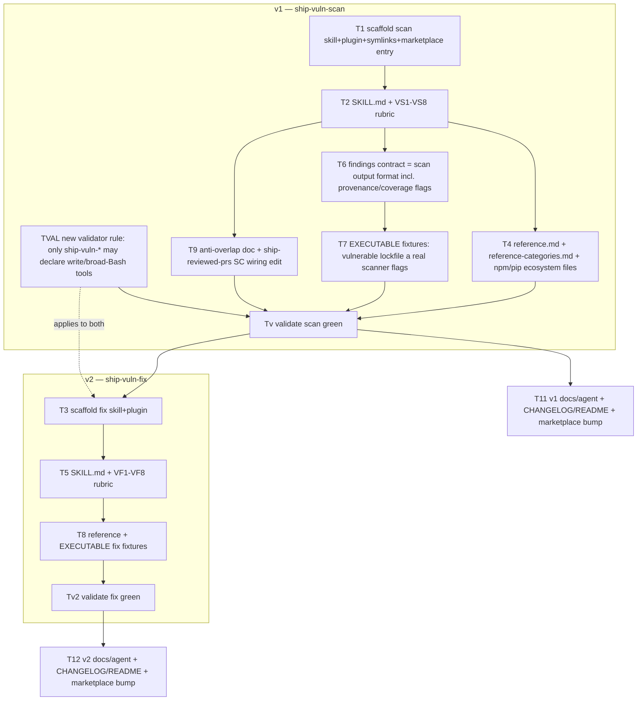

# ship-vuln-scan + ship-vuln-fix — Design Plan

Two new booster skills: a known-CVE/vulnerability **detection** skill and a **remediation** skill,
designed as a matched pair that drives the classic vuln-management loop
(scan → triage → fix → verify → document). Audited in `standard` mode
(pragmatist + production personas; adversarial persona crashed mid-run — see Audit Gaps).

## Goal

Fill the gap between `ship-secure-code` (finds *novel* bugs in *your* code via a SAST-style
rubric) and the real-world need to find and fix **known CVEs in dependencies, container images,
IaC, and secrets**. `ship-secure-code` explicitly does not do dependency/known-CVE scanning, and
explicitly defers auto-remediation as "a footgun." These two skills own that surface.

### Success criteria
- Both skills pass `scripts/validate-skills.py` and `scripts/check-skill-links.py`.
- Each `SKILL.md` ≤ 500 lines; `marketplace.json` valid; per-file plugin symlinks complete.
- `ship-vuln-scan` produces a normalized, reproducible findings artifact (OSV-schema + triage +
  **scan-engine provenance**).
- `ship-vuln-fix` never auto-applies a change that fails the **evidence-based** apply gate, and
  every auto-apply emits a structured remediation audit record.
- Anti-overlap boundaries with `ship-secure-code` / `ship-devops` documented; `ship-reviewed-prs`
  SC persona wiring updated.
- Test fixtures: the **CI-gated** contract stays the family's model-replay (`input.*` +
  `expected-output.md`, which `validate-skills.py` FIXTURE-PARITY checks). An **executable** fixture
  (a real scanner flags a deliberately-vulnerable input) is valuable but **CI installs no scanners and
  has no Docker/network** (round-2 family-05) — so it ships as an *optional, separately-gated* local
  job (or deferred), not as part of "validate green." Don't claim CI runs scanners.

### Non-goals
License-compliance scanning · runtime/DAST scanning · a third orchestration plugin · auto-applying
breaking/major upgrades · changing the read-only stance of the existing review skills · auto-fixing
code-level vulnerabilities (that remains `ship-secure-code`'s deferred footgun).

## Locked decisions (intake)

| # | Decision | Rationale |
|---|----------|-----------|
| Names | `ship-vuln-scan` (detect) + `ship-vuln-fix` (remediate) | Noun-first, shared stem, no misleading `-code` suffix (they scan deps/images/IaC, not source). |
| Execution | **Hybrid** — orchestrate OSS scanners when present, fall back to manual lockfile/advisory analysis | Known-CVE matching needs authoritative advisory data; pure-rubric is too weak. |
| Scope | deps (SCA) + container images + IaC misconfig + secrets, + SBOM/VEX | User-selected full supply-chain footprint. |
| Autonomy | **Tiered, evidence-gated** — apply mechanical fixes (gated + verified), advise on risky | Honors the "footgun" scar where it matters; automates only what is provably safe. |

## Approach (chosen: A, phased)

**A — two sibling skills coupled by a shared normalized findings contract.** Chosen over
B (one skill, two modes — bloats SKILL.md, muddies the apply gate) and C (a third orchestration
plugin — over-built; the loop is just `ship-vuln-fix` re-invoking `ship-vuln-scan` to verify).

**Phased delivery (audit finding pragmatist-1):** `ship-vuln-fix` is strictly downstream of
`ship-vuln-scan` (it consumes scan's artifact and re-invokes scan to verify). Detection has
standalone value; remediation does not. So:

- **v1 = `ship-vuln-scan`** — detection + triage + normalize. The findings contract ships as
  *scan's documented output format*, not a separate cross-skill deliverable (pragmatist-7).
- **v2 = `ship-vuln-fix`** — built only after the scan contract is proven by a real producer.

Both are fully specified here; execution may stop at the v1 milestone. The user asked for both —
this sequences them, it does not drop either.

**Parallel sets:** v1 `{T4, T6, T9, TVAL}` after T2; `TVAL` independent. **Barrier:** `Tv`.
v2 begins only after `Tv`. **Delegation:** T2/T5 rubric authoring → one `general-purpose`
subagent each; validation tasks run scripts directly.

## ship-vuln-scan — detection catalog (VS1–VS8)

| ID | Label | Covers |
|----|-------|--------|
| VS1 | DEP-CVE | Vulnerable direct + transitive deps. **v1: npm + pip** (lockfile-aware, OSV/GHSA match); maven/gradle/go/cargo additive. |
| VS2 | CONTAINER-CVE | OS packages + app layers (trivy/grype). **No manual fallback — if no engine, report "not scanned", never "clean".** |
| VS3 | IAC-MISCONFIG | Policy/known-misconfig in Terraform/k8s/CloudFormation (checkov/trivy). |
| VS4 | SECRET-EXPOSURE | Leaked secrets in tree **+ git history** (gitleaks/trufflehog). **Detect shallow clones (`git rev-parse --is-shallow-repository`) and a history budget; record `history_scope ∈ {full, since-ref}` — a since-ref or shallow scan is `coverage = degraded`, never silently full (round-2 secret-scan-history).** |
| VS5 | SBOM | Generate/ingest CycloneDX/SPDX; completeness. |
| VS6 | TRIAGE | CVSS + EPSS + KEV + fix-availability. **Feed snapshot timestamps pinned in the artifact (production-09); KEV-unreachable fails toward advise, never "deprioritize".** |
| VS7 | REACHABILITY | Is the vulnerable symbol actually called? Cuts false positives; feeds VEX. **Bounded suppression: reflection/dynamic-dispatch/DI/eval make static reachability structurally false-negative, so reachability only *deprioritizes* at high confidence; it NEVER downgrades a high-CVSS or high-EPSS finding below a severity floor (round-2 reachability-FN).** |
| VS8 | NORMALIZE | Scanner selection, **per-tool version-range + exit-code + DB-freshness handling**, JSON parse into per-surface record types, dedup (alias-aware), **graceful fallback that records a coverage-degraded flag (production-07)**. |

### Findings contract (scan's output format)
**NOT "one OSV schema"** (round-2 tooling-02): OSV is a *package-vulnerability* schema and cannot
represent IaC misconfig (checkov `CKV_*` policy ids), secrets (file:line+rule), or container-layer
distro advisories (RHSA/DSA/ALAS). The contract is a **documented superset with one record type per
surface**: `package-vuln` (OSV-shaped), `container-finding` (layer + distro-advisory), `iac-misconfig`
(framework + policy-id + file), `secret` (file:line + rule + commit). A shared envelope carries the
common triage/provenance fields below.

**Mandatory provenance / triage fields** (audit-driven):
- `scan_engine` + `engine_version` + `advisory_db_timestamp` + `db_snapshot_id` per finding.
  The parser **acts on `engine_version`**: each tool has a *supported version range*; outside it,
  `coverage = degraded` and the record is not trusted (round-2 tooling-01).
- `coverage` ∈ `{full, degraded, not-scanned}` per surface — distinguishes "scanned & clean" from
  "couldn't scan." A **present scanner with a missing/stale DB or unpullable image is `not-scanned`,
  never clean** (round-2 tooling-06).
- `epss_snapshot` / `kev_snapshot` timestamps, and a resolved **CVE↔GHSA alias set** so KEV lookup
  (keyed on CVE) still fires for GHSA-only findings; advisory-source disagreement resolved by an
  explicit **source-precedence rule** (round-2 tooling-03).
- Each surface tool has a **declared exit-code map** `{0 → clean, <finding-code> → findings,
  else → error/degraded}` — nonzero-on-findings must not be read as tool failure (round-2 tooling-05).

## ship-vuln-fix — remediation catalog (VF1–VF8)

| ID | Label | Covers |
|----|-------|--------|
| VF1 | UPGRADE-STRATEGY | Minimal-fix vs latest. **Risk is classified by evidence, not semver delta (production-02).** |
| VF2 | TRANSITIVE-RESOLUTION | npm `overrides`, yarn `resolutions`, pip constraints, maven `dependencyManagement`, go `replace`. **Must keep manifest+lockfile self-consistent (production-11).** |
| VF3 | BREAKING-CHANGE | Changelog/migration analysis; test-gated. |
| VF4 | MITIGATION | No-fix-available: config, feature-disable, network control, backport/patch. |
| VF5 | VERIFICATION | Re-scan with the **same engine + replayed `db_snapshot_id`** (not vague "stronger" — round-2 tooling-10), comparing **only the target CVE-set for closure AND asserting no NEW finding appeared in the bumped subtree** (round-2 rescan-closure) + build/tests + **clean frozen install** (`npm ci` / `--frozen-lockfile` / `go mod verify`). |
| VF6 | PRIORITIZE/BATCH | Order by KEV > EPSS > CVSS×reachability. **Per-fix atomic apply→verify→commit-or-revert — never batch-then-revert (production-04).** **Convergence bound: cap fix iterations and require monotonic re-scan-delta decrease; if a peer-dep/transitive conflict makes the delta stall or oscillate, STOP and advise (round-2 verify-loop).** |
| VF7 | ACCEPTED-RISK/VEX | Document non-exploitable / won't-fix with justification + expiry. |
| VF8 | APPLY-DISCIPLINE | The **evidence-based** apply gate (below) + rollback discipline. |

### The apply gate (rewritten from the audit — VF8)
A fix is **auto-applied** (behind a confirmation gate) ONLY when ALL hold:
1. Working tree is **clean** before any edit (else refuse — rollback would be undefined).
2. Fix is a version change with a **reviewed changelog** showing no breaking/behavioral change (not "patch/minor ⇒ safe").
3. The new package introduces **no new install scripts** (`postinstall`/`setup.py` hooks). Installs run with **scripts disabled / sandboxed**; an install script present ⇒ **advise**.
4. After apply: **full test suite green** + **clean frozen install consistent** + **re-scan confirms closure with a same-or-stronger engine** (degraded/absent engine ⇒ cannot prove closure ⇒ **advise**, don't apply).
5. Each applied fix is **atomically committed** (or reverted with reinstall) before the next.

Everything else — major/breaking upgrades, code-level mitigations, no-fix-available,
degraded-coverage verify — is **advise-only** with an exact diff and verification steps.

### Remediation audit log (production-08; path corrected by round-2 family-03)
Every auto-apply emits a structured record: CVE, matching scanner+version+DB-timestamp, old→new
version, changelog evidence, verify evidence (tests run/passed, re-scan engine), and the gate
approver. **NOT written to `docs/agent/`** — that tree is owned by `ship-agent-context` with a fixed
nine-folder taxonomy, a MANIFEST every note must be indexed in, and a bounded always-read `status/`
folder; an unbounded per-fix log fits none of it and would bloat the most-read folder. The log lives
in a **dedicated, out-of-band path: `docs/security/vuln-remediation/<date>-<cve>.json`** (or a
`.ship-vuln/` dir), with its own append-only index — no MANIFEST contract, no collision. Symmetric to
VF7's VEX-for-unfixed.

## Tooling boundary (B2 — production-03)
- `ship-vuln-scan` `allowed-tools`: `Read, Grep, Glob, Bash` — **Bash scoped to a scanner/PM
  allowlist** (osv-scanner, trivy, grype, pip-audit, npm/pnpm/yarn audit, checkov, gitleaks, syft).
- `ship-vuln-fix` `allowed-tools`: adds `Edit` — **scoped to lockfile/manifest paths only**.
- **New `validate-skills.py` rule** — *reframed after round-2 family-04*. The naive "only `ship-vuln-*`
  may write" is **false**: `ship-agent-context`, `ship-better-plans`, `ship-execute`, and
  `obsidian-knowledge-graph` already declare `Write`/`Edit`/scoped `Bash`. The real invariant is
  **the security *review* family stays read-only**: an explicit allowlist —
  `{ship-clean-code, ship-tested-code, ship-secure-code, ship-devops, ship-reviewed-prs}` must be
  exactly `Read, Grep, Glob`; `ship-vuln-*` may add scoped `Bash`/`Edit`. This is **net-new parser
  work**, not "a rule": the frontmatter parser currently stores `allowed-tools` as a single scalar
  string, so the check must tokenize the comma/paren grammar (incl. `Bash(npm ci *)`-style scopes).

## Anti-overlap & wiring
- **VS4 secrets** = repo-wide/historical scan ↔ `ship-secure-code` **SEC7** = secret-literal in code under review.
- **VS2/VS3** = known-CVE/policy match on the *built artifact* ↔ `ship-devops` **DEV4/DEV3** = Dockerfile/IaC *hygiene*.
- **Supply-chain**: `ship-secure-code`'s supply-chain category = risky-dependency-add review patterns; VS1 = authoritative known-CVE match. Cross-reference both ways.
- **Wiring (dueling-delegation arbiter — round-2 family-02).** `ship-reviewed-prs` SC persona
  *already* routes supply-chain depth to `ship-secure-code` (SKILL.md:106 Owns, :149 Delegation Table).
  A lockfile change is a supply-chain signal, so naively adding a `ship-vuln-scan` target double-routes.
  The wiring edit must be **surgical and three-part**: (1) scope the SC→`ship-secure-code` row to
  *code-pattern* supply-chain risk (install scripts, typosquat, integrity), (2) add a SC→`ship-vuln-scan`
  row triggered specifically by a **lockfile/manifest change** for *known-CVE* depth, (3) add the
  anti-overlap clause to `reference-personas.md`. Without all three the reviewer gets two "go run X"
  pointers for one trigger.

## Files to touch
- `skills/ship-vuln-scan/` — SKILL.md, reference.md, reference-categories.md, ecosystem-npm.md, ecosystem-pip.md, contract.md, overrides.example.md, examples/, tests/fixture-*/
- `skills/ship-vuln-fix/` — (v2) same shape
- `plugins/ship-vuln-scan/`, `plugins/ship-vuln-fix/` — plugin.json + per-file symlinks
- `.claude-plugin/marketplace.json` — two new entries (category: `security` or `code-quality`)
- `scripts/validate-skills.py` — tokenizing tool-policy rule (review-family read-only allowlist)
- `skills/ship-reviewed-prs/` — three-part wiring edit: SC Owns/Delegation rows + `reference-personas.md` anti-overlap clause
- `docs/security/vuln-remediation/` — dedicated audit-log path (NOT `docs/agent/`)
- `CHANGELOG.md`, `README.md`, `docs/agent/` (decisions, MANIFEST)

## Status
Planning complete and **audited twice** (standard: 10 findings; adversarial-only re-pass: 14 findings;
all folded in). **v1 (`ship-vuln-scan`) EXECUTED and shipped** to branch `feature/ship-vuln-scan`
(commit 779c638) via ship-execute — 9 tasks, validators green, ship-reviewed-prs APPROVE. **v2
(`ship-vuln-fix`) remains to be built** per the VF1–VF8 spec above. Net of round-2, the heaviest remaining design work is **VS8/the contract**
(per-surface record types, per-tool version/exit-code/DB handling, alias resolution) and the
**`validate-skills.py` tokenizing tool-policy rule** — both materially bigger than the first draft implied.

## Audit history
- **Round 1 (standard, pragmatist+production):** 10 confirmed, 2 blockers — semver-apply RCE and
  Bash/Edit trust-model. Adversarial persona crashed; gap flagged. All folded in.
- **Round 2 (adversarial-only, 3 lenses):** 14 confirmed, 3 blockers — contract/normalization
  under-spec (schema drift, exit codes, OSV-mis-target, advisory disagreement, DB staleness), plus
  three *factual* corrections to the plan's claims about the existing repo (dueling SC delegation;
  `docs/agent/` namespace collision; the validator rule contradicting 5 existing write-declaring
  skills). All folded in (see the round-2 callouts inline). 3 refute agents crashed mid-run; their
  findings were conservatively dropped, so confirmed counts are a floor, not a ceiling.

## Related
- [ship-vuln-skills-architecture](../decisions/ship-vuln-skills-architecture.md) — the keystone decisions
- [ship-better-plans-design](./ship-better-plans-design.md) — the planning skill that produced this
- [merge-ship-code-into-booster](../decisions/merge-ship-code-into-booster.md) — the family/marketplace this joins
