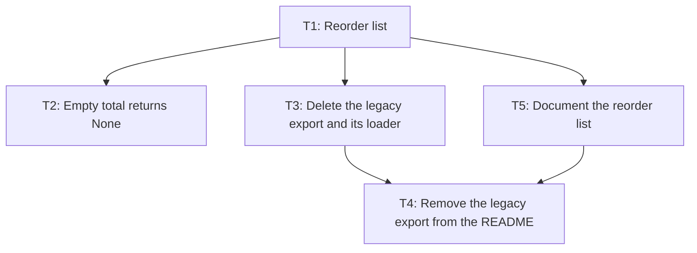

# Plan: reorder list, empty-total change, and legacy export removal

## Summary
Add a reorder list to the stock module, change what an empty inventory totals, and remove the legacy CSV export and its loader once the export is archived. Three small changes to one package; the only step that cannot be undone from the repository is deleting the export.

## Context
- **Problem:** buyers compute reorder lists by hand; the empty total is ambiguous to callers; the legacy export is dead weight.
- **Why now:** not stated.
- **Request:** "Add a reorder list, make empty totals explicit, and drop the legacy export."

## Success criteria
- SC-1: `reorder_list` returns the SKUs at or below a threshold. (stated)
- SC-2: an empty inventory's total is explicit to callers. (stated)
- SC-3: the legacy export and its loader are gone from the repository. (stated)

## Non-goals
- A command-line interface.

## Constraints
- Standard library only.

## Facts and assumptions
- F-1: `total(items)` sums `qty` — `inventory/stock.py:4`
- F-2: the legacy loader reads `data/legacy.csv` — `inventory/legacy.py:6`
- F-3: tests run with unittest — ran: `python3 -m unittest discover -s tests` → 3 passed
- A-1: the legacy export has been archived outside the repository — if wrong: deleting it loses the only copy — settled by: the Gate on T3

## Approach
One viable approach: edit the stock module in place and delete the legacy files.

- **Chosen:** in-place edits — **deciding factor:** the package is four files; nothing else is proportionate.

## Risks and rollback
- **Risk:** the legacy export is the only copy. Handled by the Gate on T3.
- **Rollback:** revert the commits; the export is recoverable from git history only if it was never rewritten.
- **Migration:** N/A — no stored state besides the export itself.

## Specification

### Acceptance criteria
- AC-1 (SC-1): `reorder_list([{"sku": "A", "qty": 1}, {"sku": "B", "qty": 9}], 2)` returns `["A"]`; items exactly at the threshold are included; the result is sorted by SKU — verify: `python3 -m unittest tests.test_reorder`
- AC-2 (SC-2): `total([])` returns `None` — verify: `python3 -m unittest discover -s tests`
- AC-3 (SC-3): `data/legacy.csv`, `inventory/legacy.py` and `tests/test_legacy.py` do not exist and the suite passes — verify: `python3 -m unittest discover -s tests`
- AC-4 (SC-1): the README documents `reorder_list` — verify: `grep -c reorder_list README.md` prints 1 or more
- AC-5 (SC-3): the README no longer mentions the legacy export — verify: `grep -c legacy README.md` prints 0

### Non-functional targets
N/A — a small library with no performance or security surface.

### Interfaces and data shapes
- `reorder_list(items: list[dict], threshold: int) -> list[str]` in `inventory/stock.py`.

### Edge cases
| Case | Expected behaviour | Covered by |
|------|--------------------|------------|
| Empty inventory in `reorder_list` | Returns `[]` | AC-1 |
| Item exactly at the threshold | Included | AC-1 |

## Verification
- **Setup:** none; Python 3 and the repository are enough.
- **Commands:** test `python3 -m unittest discover -s tests` — defined in `README.md`
- **Baseline:** `python3 -m unittest discover -s tests` → 3 passed.
- **Final check:** SC-1 by AC-1 and AC-4; SC-2 by AC-2; SC-3 by AC-3 and AC-5, all in the test run and the two greps.

## Tasks

### Conventions for every task
- Standard library only.
- Do not edit or delete an existing test unless the card lists that test file under Files.
- The whole suite (`python3 -m unittest discover -s tests`) passes before a task is reported done.

### T1 — Reorder list
- **Depends on:** none
- **Covers:** AC-1
- **Files:** `inventory/stock.py` (modify), `tests/test_reorder.py` (new)
- **Do:** Add `reorder_list(items, threshold)` to `inventory/stock.py`, beside `total`. It returns the `sku` of every item whose `qty` is at or below `threshold`, sorted by SKU, and `[]` for an empty inventory. Write the tests first in `tests/test_reorder.py`, in the style of `tests/test_stock.py`: the example in AC-1, an item exactly at the threshold, and the empty inventory. Do not change `total`.
- **Verify:** `python3 -m unittest tests.test_reorder` → passes
- **Kind:** code · **Size:** S · **Reversibility:** safe

### T2 — Empty total returns None
- **Depends on:** T1
- **Covers:** AC-2
- **Files:** `inventory/stock.py` (modify)
- **Do:** Change `total(items)` in `inventory/stock.py` so that an empty inventory returns `None` instead of 0, and update its docstring. Non-empty behaviour is unchanged.
- **Verify:** `python3 -m unittest discover -s tests` → passes
- **Kind:** code · **Size:** S · **Reversibility:** safe

### T3 — Delete the legacy export and its loader
- **Depends on:** T1
- **Covers:** AC-3
- **Files:** `data/legacy.csv` (delete), `inventory/legacy.py` (delete), `tests/test_legacy.py` (delete)
- **Do:** Delete `data/legacy.csv`, the loader `inventory/legacy.py` and its test `tests/test_legacy.py`. Nothing else imports the loader.
- **Verify:** `python3 -m unittest discover -s tests` → passes; `ls data/legacy.csv inventory/legacy.py tests/test_legacy.py` → all three report "No such file"
- **Kind:** code · **Size:** S · **Reversibility:** destructive: the export exists nowhere else unless it was archived
- **Gate:** the user confirms the legacy export has been archived outside the repository

### T4 — Remove the legacy export from the README
- **Depends on:** T3, T5
- **Covers:** AC-5
- **Files:** `README.md` (modify)
- **Do:** In `README.md`, remove the Usage bullet about `inventory.legacy.load_legacy()` and `data/legacy.csv`. Leave the rest of the file as it is.
- **Verify:** `grep -c legacy README.md` → prints 0
- **Kind:** docs · **Size:** S · **Reversibility:** safe

### T5 — Document the reorder list
- **Depends on:** T1
- **Covers:** AC-4
- **Files:** `README.md` (modify)
- **Do:** In `README.md`, add a Usage bullet for `inventory.stock.reorder_list(items, threshold)`: it returns the SKUs at or below the threshold, sorted. Leave the rest of the file as it is.
- **Verify:** `grep -c reorder_list README.md` → prints 1 or more
- **Kind:** docs · **Size:** S · **Reversibility:** safe

### Execution order

- Wave 1: T1
- Wave 2: T2, T3, T5 (can run in parallel) (T3 waits for its gate and runs alone)
- Wave 3: T4
- Critical path: T1 → T3 → T4

## Open questions
None.

## Audit
None, by the user's choice.

## Status
Approved by the user on 2026-10-02. Next: execute.

## Related
None.
