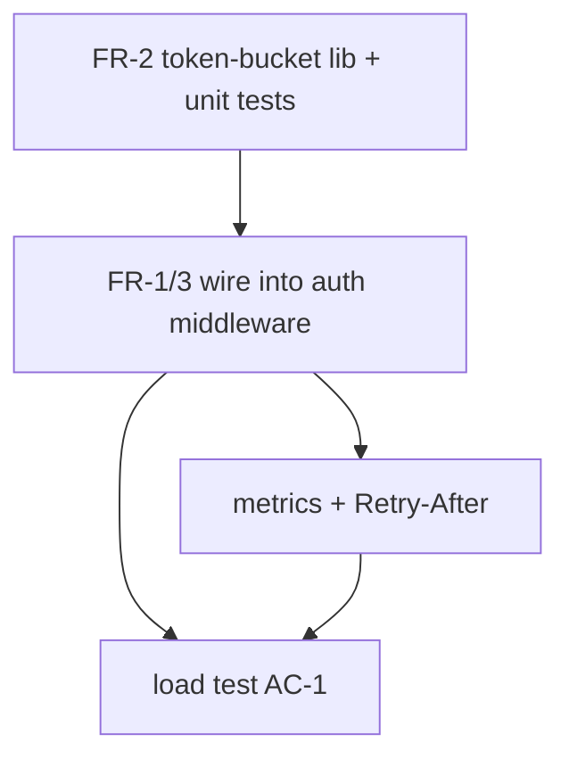

# Example — feature plan produced by `/ship-plan`

A trimmed example of what the skill writes to `docs/agent/plans/` for a new feature. Shows the intake → tradeoffs → spec → DAG → audit shape end-to-end.

---

```markdown
---
type: plan
status: active
created: 2026-06-10
updated: 2026-06-10
author: claude-opus-4-8
tags: [feature, api, rate-limit]
importance: standard
---

# Plan: per-tenant API rate limiting

## Context
Problem (what): a single tenant can exhaust shared API capacity, degrading others.
Why: two incidents last month traced to one tenant's batch job; need fairness.

## Success Criteria
- No tenant can consume >X% of capacity in a rolling 1-minute window.
- 429s carry a Retry-After header. p99 added latency < 2ms.

## Non-Goals
- Billing/quotas (separate plan). Per-endpoint limits (later).

## Constraints & Assumptions
- Constraint: must run on existing Redis; no new infra this quarter.
- Assumption (flagged): tenant id is already on the auth context. → became OQ-1.

## Approach (chosen)
Token-bucket in Redis via the existing `redisClient` (src/cache/redis.ts), enforced
in the existing auth middleware (src/http/middleware/auth.ts) — reuses both, no new
service. Chosen over a sidecar (more infra) and in-memory (not shared across pods).

### Tradeoffs considered
| Approach | Effort | Risk | Reversibility | Blast radius | Notes |
|----------|--------|------|---------------|--------------|-------|
| Redis token-bucket (rec) | 2 | 2 | reversible | middleware only | reuses redisClient |
| Sidecar proxy | 4 | 3 | hard-to-reverse | infra-wide | new deploy unit |
| In-memory per-pod | 1 | 4 | reversible | per-pod | not shared → unfair |

## Risks & Rollback
- Redis outage → fail-open (allow), log, alert. Mitigation: circuit-breaker around the check.
- Rollback: feature flag `RATE_LIMIT_ENABLED`, default off; flip off to disable.

## Specification
- FR-1: middleware reads tenant id; on missing → fail-open + warn (OQ-1).
- FR-2: token-bucket key `rl:{tenant}:{minute}`, refill R/s, burst B.
- FR-3: over-limit → 429 + Retry-After.
- Non-functional: < 2ms p99 added latency; counters exported to metrics.
- Acceptance: AC-1→FR-2 (load test: 1 tenant capped, others unaffected).
- Edge cases: missing tenant, Redis timeout, clock skew at minute boundary, burst at boundary.

## Execution DAG

- Parallelizable: { T3, T4 after T2 }   ·   Critical path: T1→T2→T4
- Delegation: T1 feature-dev · T4 code-reviewer + load harness
- Checkpoint after T2 (flag still off in prod).

## Audit
standard, 4 personas (core + Test-strategist). Confirmed + folded in:
- [blocker] clock-skew double-count at minute boundary → switched to sliding window.
- [major] fail-open unmonitored → added alert on fail-open rate.

## Status
Approved. Next: execution (user chose "stop here — resume later").

## Related
- [open-question: tenant-id-on-auth-context](../open-questions/tenant-id-on-auth-context.md)
```
