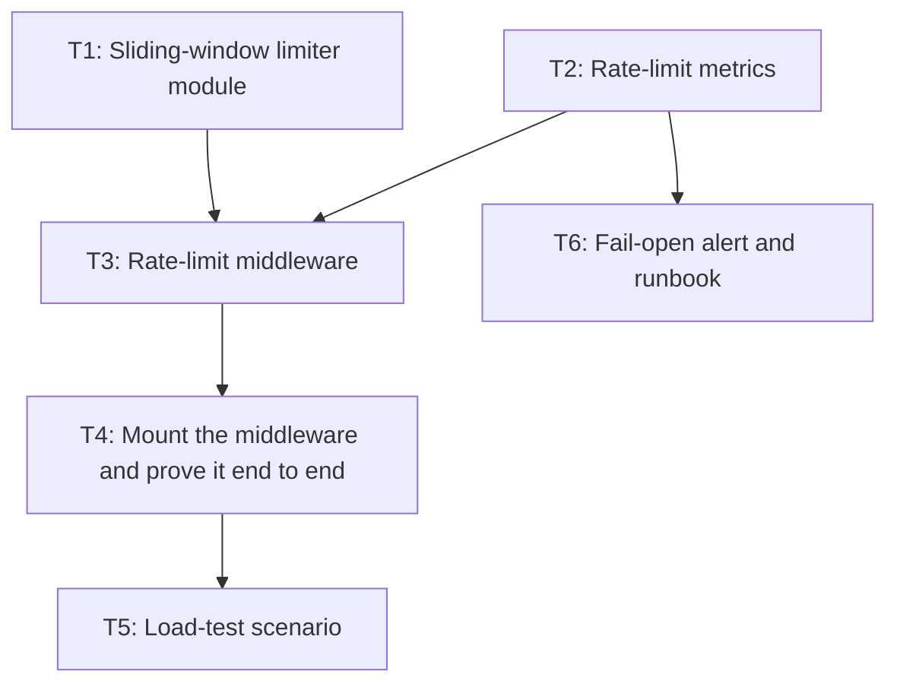

# Plan: per-tenant API rate limiting

<!-- Example of form and level of detail for a mid-sized feature with the full review. Do not reuse its decisions, numbers or task breakdown. It passes `lint_plan.py --no-paths` (the repository it describes is fictional). -->

## Summary
Add per-tenant rate limiting to the public API so one tenant's traffic cannot exhaust shared capacity. A sliding-window counter in the existing Redis is checked by a new middleware mounted after auth, behind a feature flag. The biggest risk is the limiter turning a Redis problem into an API outage, so it fails open and alerts. Done when an integration test shows one tenant capped while another is unaffected, and a load test against staging shows under 2 ms of added p99 latency.

## Context
- **Problem:** a single tenant can consume all API capacity and degrade every other tenant.
- **Why now:** two incidents last month were traced to one tenant's batch job.
- **Request:** "Add per-tenant rate limiting to the API so one customer's batch job can't take everyone else down."

## Success criteria
- SC-1: a tenant over its limit receives 429 with `Retry-After`, while other tenants' requests succeed. (stated)
- SC-2: the limiter adds less than 2 ms to p99 latency at 500 requests per second. (the user's figures, given at the checkpoint)
- SC-3: a limiter failure cannot take the API down: it allows traffic when Redis is unavailable, and it can be switched off without a deploy. (inferred, confirmed at the checkpoint)

## Non-goals
- Billing or quota enforcement (separate plan).
- Per-endpoint limits.
- A UI for editing limits.

## Constraints
- Existing Redis only; no new infrastructure this quarter.
- No new npm dependencies.

## Facts and assumptions
- F-1: the auth middleware sets `req.auth.tenantId` on every authenticated request — `src/http/middleware/auth.ts:41`
- F-2: one shared Redis client with a 50 ms command timeout — `src/cache/redis.ts:12`
- F-3: middleware is registered in order in one place — `src/http/app.ts:27`
- F-4: feature flags are read with `flags.isEnabled(name)`, change without a deploy, and can be forced per process with `FLAG_<NAME>=true|false` — `src/config/flags.ts:8`
- F-5: counters are created with `metrics.counter(name, labels)`; `src/metrics/http.ts` is the pattern to follow — `src/metrics/registry.ts:19`
- F-6: integration tests run against a Redis test container started by the test setup — `test/integration/setup.ts:5`
- F-7: load scenarios start the API themselves through `loadtest/lib/server.js`; `loadtest/scenarios/baseline.js` is the pattern, run with `npm run loadtest` — `package.json:23`
- F-8: alert rules live in `ops/alerts/` and are checked by `npm run lint:alerts`; `ops/alerts/http.yml` is the pattern — `package.json:25`
- F-9: the suite is green before this work — ran: `npm test` → 412 passed
- A-1: 600 requests per minute is the right default limit — if wrong: legitimate heavy tenants are throttled — settled by: accepted by the user at the checkpoint, and FR-5 makes it overridable per tenant

## Approach
| Option | Meets the success criteria? | Effort | Main risk | Reversibility | Verdict |
|--------|-----------------------------|--------|-----------|---------------|---------|
| A. Sliding-window counter in Redis, checked in middleware | Yes | M | The Redis failure path | Flag off | chosen |
| B. Fixed-window counter in Redis, checked in middleware | SC-1 only loosely: allows twice the limit across a window boundary | S | Boundary bursts | Flag off | rejected because a burst at the boundary is the incident we are preventing |

- **Chosen:** A — **deciding factor:** it enforces the limit per tenant without boundary bursts.
- **Ruled out before comparison:** limiting at the API gateway, which runs before auth and cannot see the tenant (F-1).
- **Builds on:** `src/cache/redis.ts` (client), `src/config/flags.ts` (kill switch), `src/metrics/registry.ts` (counters), the middleware pattern in `src/http/middleware/auth.ts`.

## Risks and rollback
| Risk | Why it matters | Handled by | How we would notice |
|------|----------------|------------|---------------------|
| Redis slow or down makes every request fail | The limiter would cause the outage it exists to prevent | FR-3 fail-open (T3), AC-3 | The FR-7 alert on `ratelimit_fail_open_total` (T6) |
| Default limit throttles a legitimate tenant | A paying customer is blocked | FR-5 per-tenant override (T1) | `ratelimit_rejected_total` by tenant |
| Limiter adds latency to every request | SC-2 | One Redis round trip per request (T1), AC-7 | The final check against staging |

- **Rollback:** turn `rate_limit_enabled` off (no deploy). The change is additive, so reverting it is also safe.
- **Migration:** N/A — no stored data or schema changes; Redis keys expire on their own.

## Specification

### Requirements
- FR-1: requests that carry a tenant id are counted per tenant over a sliding 60-second window in Redis (SC-1)
- FR-2: a request over the limit is answered with 429, a `Retry-After` header in seconds and a JSON error body, and does not reach the route handler (SC-1)
- FR-3: if the Redis check errors or times out, the request is allowed and `ratelimit_fail_open_total` is incremented (SC-3)
- FR-4: the limiter runs only when the flag `rate_limit_enabled` is on; the flag defaults to off (SC-3)
- FR-5: the limit defaults to 600 per minute and can be overridden per tenant in `rateLimit.overrides` (SC-1)
- FR-6: counters `ratelimit_allowed_total`, `ratelimit_rejected_total` (labelled by tenant) and `ratelimit_fail_open_total` are exported (SC-3)
- FR-7: an alert fires when fail-open exceeds 1% of requests for 5 minutes, with a runbook entry (SC-3)

### Acceptance criteria
- AC-1 (FR-1, FR-2): request 601 within 60 s from tenant A gets 429 with `Retry-After` between 1 and 60, while tenant B gets 200 — verify: `npm test -- test/integration/rate-limit.test.ts`
- AC-2 (FR-1): 600 requests at the end of one minute followed by 600 at the start of the next are not all allowed; a rejected request is not added to the window; concurrent calls at the limit never record more than the limit — verify: `npm test -- src/ratelimit/window.test.ts`
- AC-3 (FR-3): with Redis stopped, requests return 200 and the fail-open counter increases — verify: `npm test -- test/integration/rate-limit.test.ts`
- AC-4 (FR-4): with the flag off the middleware makes no Redis call — verify: `npm test -- src/http/middleware/rate-limit.test.ts`
- AC-5 (FR-5): a tenant with an override of 1200 is allowed request 601 — verify: `npm test -- src/ratelimit/window.test.ts`
- AC-6 (FR-6): each counter increments on its path — verify: `npm test -- src/http/middleware/rate-limit.test.ts`
- AC-7 (FR-1, SC-2): p99 latency with the limiter on is within 2 ms of the limiter off at 500 rps — verify: `npm run loadtest -- --scenario rate-limit --target staging`
- AC-8 (FR-7): the alert rule passes the rule linter and names the runbook — verify: `npm run lint:alerts`

### Non-functional targets
- Latency: under 2 ms added at p99 at 500 rps (SC-2; the user's figures), checked by AC-7.

### Interfaces and data shapes
- `checkLimit(tenantId: string): Promise<{ allowed: boolean; retryAfterSec: number }>` in `src/ratelimit/window.ts`; rejects with `RateLimitStoreError` when Redis errors or times out.
- 429 response: header `Retry-After: <seconds>`, body `{ "error": "rate_limited", "retryAfterSec": <seconds> }`.
- Redis: sorted set `rl:{tenantId}` of request timestamps in milliseconds, expiring after 120 s. Prune, count and add happen in one Lua script so the check is atomic, using the Redis server clock.

### Edge cases
| Case | Expected behaviour | Covered by |
|------|--------------------|------------|
| No tenant id (health check, unauthenticated routes) | Not limited, no Redis call | AC-4 (T3 tests this path too) |
| Redis timeout or error | Allowed; fail-open counter incremented | AC-3 |
| Burst across a window boundary | Counted in the same sliding window | AC-2 |
| Concurrent requests at the limit | Atomic script; never more than the limit recorded | AC-2 |
| Rejected request retried immediately | Rejected again; rejected requests are not added to the window | AC-2 |
| Clocks differ between API pods | Timestamps come from Redis, not the pods | T1 unit test |
| Tenant goes idle | Key expires after 120 s | T1 unit test |

## Verification
- **Setup:** `npm ci`; Docker running (the integration tests start their own Redis container, F-6).
- **Commands:** build `npm run build` · test `npm test` · lint `npm run lint` — defined in `package.json`, run by `.github/workflows/ci.yml`
- **Baseline:** `npm test` → 412 passed before this work (F-9).
- **Final check:** SC-1 by AC-1 and AC-5 in CI. SC-3 by AC-3, AC-4 and AC-8 in CI. SC-2 by AC-7, which the user runs against staging before turning the flag on, because a 2 ms difference cannot be measured reliably on a developer machine.

## Tasks

### Conventions for every task
- Run `npm ci` first in a fresh checkout. No new npm dependencies.
- Unit tests sit next to the code as `*.test.ts` (vitest); integration tests go under `test/integration/`.
- Follow the structure and error handling of `src/http/middleware/auth.ts`.
- Run `npm run build` and the tests named in the card's Verify. The full suite runs once, at the end, because the integration tests share one Redis container.

### T1 — Sliding-window limiter module
- **Depends on:** none
- **Covers:** FR-1, FR-5, AC-2, AC-5
- **Files:** `src/ratelimit/window.ts` (new), `src/ratelimit/window.lua` (new), `src/ratelimit/window.test.ts` (new), `src/config/schema.ts` (modify)
- **Do:** Implement `checkLimit(tenantId)` returning `{ allowed, retryAfterSec }`. Use the shared client from `src/cache/redis.ts`. One Lua script on the sorted set `rl:{tenantId}`: read the Redis server time, remove entries older than 60 s, count, and add the current timestamp only when the count is under the limit; set the key to expire after 120 s. `retryAfterSec` is the time until the oldest entry leaves the window, rounded up, minimum 1. The limit is `rateLimit.overrides[tenantId]` when present, otherwise `rateLimit.default` (600); add both keys to the config schema. Let Redis errors and timeouts surface as `RateLimitStoreError`. Write the tests first: the boundary burst, a rejected request not being recorded, concurrent calls at the limit, the override, key expiry, and timestamps coming from Redis. Do not add middleware here.
- **Verify:** `npm test -- src/ratelimit/window.test.ts` → all pass
- **Kind:** code · **Size:** M · **Reversibility:** safe

### T2 — Rate-limit metrics
- **Depends on:** none
- **Covers:** FR-6
- **Files:** `src/metrics/ratelimit.ts` (new), `src/metrics/ratelimit.test.ts` (new)
- **Do:** Export three counters created with `metrics.counter` from `src/metrics/registry.ts`: `ratelimit_allowed_total`, `ratelimit_rejected_total` with a `tenant` label, and `ratelimit_fail_open_total`. Follow the naming and export style of `src/metrics/http.ts`. Test that each counter registers once and increments.
- **Verify:** `npm test -- src/metrics/ratelimit.test.ts` → all pass
- **Kind:** code · **Size:** S · **Reversibility:** safe

### T3 — Rate-limit middleware
- **Depends on:** T1, T2
- **Covers:** FR-2, FR-3, FR-4, AC-4, AC-6
- **Files:** `src/http/middleware/rate-limit.ts` (new), `src/http/middleware/rate-limit.test.ts` (new)
- **Do:** Export `rateLimit()` as Express middleware. If `flags.isEnabled('rate_limit_enabled')` is false, or `req.auth?.tenantId` is missing, call `next()` without touching Redis. Otherwise call `checkLimit` from `src/ratelimit/window.ts`: when allowed, increment the allowed counter and call `next()`; when not, increment the rejected counter and respond 429 with a `Retry-After` header and the body `{ error: 'rate_limited', retryAfterSec }`; on `RateLimitStoreError`, increment the fail-open counter and call `next()`. The counters come from `src/metrics/ratelimit.ts`. Unit-test all five paths with the limiter and counters mocked. Do not register the middleware in `src/http/app.ts`; a later task does that.
- **Verify:** `npm test -- src/http/middleware/rate-limit.test.ts` → all pass
- **Kind:** code · **Size:** S · **Reversibility:** safe

### T4 — Mount the middleware and prove it end to end
- **Depends on:** T3
- **Covers:** AC-1, AC-3
- **Files:** `src/http/app.ts` (modify), `test/integration/rate-limit.test.ts` (new)
- **Do:** Register `rateLimit()` from `src/http/middleware/rate-limit.ts` in `src/http/app.ts` immediately after the auth middleware, so the tenant id is available. Add an integration test that uses the Redis container from `test/integration/setup.ts` and forces the flag on with `FLAG_RATE_LIMIT_ENABLED=true`: tenant A is rejected on request 601 with a valid `Retry-After` while tenant B still gets 200; with the Redis container stopped, requests return 200 and the fail-open counter increases. Leave the flag's default as off.
- **Verify:** `npm test -- test/integration/rate-limit.test.ts` → all pass
- **Kind:** code · **Size:** S · **Reversibility:** safe

### T5 — Load-test scenario
- **Depends on:** T4
- **Covers:** none — enabling: the scenario that AC-7 is run with at the final check
- **Files:** `loadtest/scenarios/rate-limit.js` (new)
- **Do:** Add a scenario modelled on `loadtest/scenarios/baseline.js`. It starts the API through `loadtest/lib/server.js` twice, once with `FLAG_RATE_LIMIT_ENABLED=false` and once with `true`, sends 500 requests per second for 60 s spread over 20 tenants that all stay under their limits, and prints both p99 figures and their difference. With `--target staging` it skips starting the API and exits non-zero when the difference is 2 ms or more; with `--smoke` it runs for 5 s and only checks that both runs complete.
- **Verify:** `npm run loadtest -- --scenario rate-limit --smoke` → exits 0 and prints two p99 figures
- **Kind:** test · **Size:** S · **Reversibility:** safe

### T6 — Fail-open alert and runbook
- **Depends on:** T2
- **Covers:** FR-7, AC-8
- **Files:** `ops/alerts/ratelimit.yml` (new), `docs/runbooks/rate-limit.md` (new)
- **Do:** Add an alert rule in the format of `ops/alerts/http.yml` that fires when `ratelimit_fail_open_total` exceeds 1% of requests for 5 minutes, linking the runbook. Write the runbook: what the alert means, how to check Redis, how to turn `rate_limit_enabled` off, and how to raise one tenant's limit through `rateLimit.overrides`.
- **Verify:** `npm run lint:alerts` → passes
- **Kind:** infra · **Size:** S · **Reversibility:** safe

### Execution order

```mermaid
graph TD
  T1["T1: Sliding-window limiter module"]
  T2["T2: Rate-limit metrics"]
  T3["T3: Rate-limit middleware"]
  T4["T4: Mount the middleware and prove it end to end"]
  T5["T5: Load-test scenario"]
  T6["T6: Fail-open alert and runbook"]
  T1 --> T3
  T2 --> T3
  T3 --> T4
  T4 --> T5
  T2 --> T6
```
- Wave 1: T1, T2 (can run in parallel)
- Wave 2: T3, T6 (can run in parallel)
- Wave 3: T4
- Wave 4: T5
- Critical path: T1 → T3 → T4 → T5

## Open questions
- OQ-1 (non-blocking): should the flag be turned on for all tenants at once or one cohort at a time? — default if unanswered: on in staging for a week, then all tenants.

## Audit
Full review. Reviewers: executor, grounding, adversary, scope, ops (chosen by the script: the plan adds an alert and a feature flag). First run: 14 findings raised, 5 confirmed, 1 disputed, none dropped; every reviewer reported. The first finding below changed the approach, so the user was told and the review was run again on the revised plan: nothing serious confirmed.

- [blocker, adversary] the first draft used a fixed window, which lets a tenant send twice the limit across a boundary → the approach changed to a sliding window; the user confirmed the change before the specification was redone (FR-1, AC-2, T1), and the review was re-run.
- [major, grounding] the draft read the tenant from a request header, but auth already sets `req.auth.tenantId` (F-1) → fixed in FR-1 and T3.
- [major, executor] T3 and T4 both edited `src/http/app.ts` and could have run in parallel → fixed: mounting moved entirely into T4.
- [major, ops] nothing would tell anyone the limiter was failing open → fixed: FR-7, AC-8 and T6 added.
- [major, adversary] rejected requests were added to the window, so a client retrying in a loop could never recover → fixed in T1, AC-2 and the edge-case table.
- [disputed, scope] per-tenant overrides were not in the request → kept: the user confirmed at the checkpoint that two tenants need a higher limit (A-1).

## Status
Approved by the user on 2026-09-14. Next: `/ship-execute docs/agent/plans/per-tenant-api-rate-limiting.md`. Nothing blocked.

## Related
- `[rate-limit-rollout](../open-questions/rate-limit-rollout.md)` — OQ-1, kept open past this session
