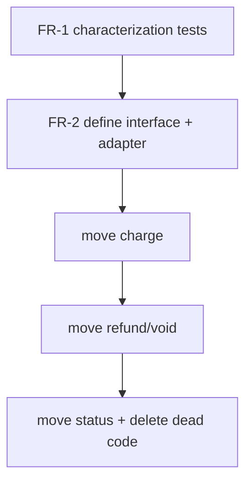

# Example — refactor plan produced by `/ship-plan ultra`

A trimmed example for a refactor run in **ultra** mode (loop-until-dry audit). Refactors are where the reversibility column and the convergence loop earn their keep.

---

```markdown
---
type: plan
status: active
created: 2026-06-10
updated: 2026-06-10
author: claude-opus-4-8
tags: [refactor, payments, extract-module]
importance: core
---

# Plan: extract payment logic out of OrderService

## Context
Problem (what): OrderService (1.8k lines, src/orders/OrderService.ts) mixes order
state with payment-provider calls; changes to one risk the other.
Why: 3 of the last 5 payment bugs were regressions from unrelated order changes.

## Success Criteria
- Payment logic lives in a `PaymentGateway` module with a typed interface.
- OrderService depends only on that interface. No behavior change (characterized by existing tests + new ones).

## Non-Goals
- Changing the payment provider. Touching the DB schema.

## Constraints & Assumptions
- Constraint: zero behavior change; this is a pure refactor behind green tests.
- Assumption (flagged): existing tests cover the payment paths. → became OQ-1; gated as first task.

## Approach (chosen)
Strangler extraction: define `PaymentGateway` interface, move provider calls behind it
one method at a time, each step behind green tests. Chosen over big-bang rewrite
(irreversible, high blast radius) and "leave it" (cost keeps compounding).

### Tradeoffs considered
| Approach | Effort | Risk | Reversibility | Blast radius | Notes |
|----------|--------|------|---------------|--------------|-------|
| Strangler, incremental (rec) | 3 | 2 | reversible per step | contained | each step revertable |
| Big-bang rewrite | 4 | 5 | destructive | payments-wide | one giant risky PR |
| Do nothing | 0 | 3 | n/a | n/a | tech debt compounds |

## Risks & Rollback
- Hidden coupling surfaces mid-extraction → each step is its own commit; revert one step.
- Rollback: no flag needed — pure refactor; `git revert` the offending step.

## Specification
- FR-1: characterization tests pin current payment behavior BEFORE any move (resolves OQ-1).
- FR-2: `PaymentGateway` interface (charge, refund, void, status) with typed errors.
- FR-3: OrderService references only the interface; provider wiring via DI.
- Edge cases: partial refund, provider timeout, idempotency key reuse, double-charge guard.

## Execution DAG

- Strictly sequential (each step gated on green tests). No parallelization — safety over speed.
- Delegation: T1 ship-tested-code · T3–T5 feature-dev · review gate after each.

## Audit
ultra, 4 personas (core + Test-strategist), loop-until-dry (2 dry rounds). Folded in:
- [blocker] no characterization tests first → reordered T1 ahead of everything (round 1).
- [major] idempotency key reuse not specified → added edge case + AC (round 1).
- [minor] DI wiring untested in isolation → added unit (round 2). Round 3 dry → stop.

## Status
Approved. Next: user chose "[2] subagent-driven execution".

## Related
- [open-question: payment-path-test-coverage](../open-questions/payment-path-test-coverage.md)
```
