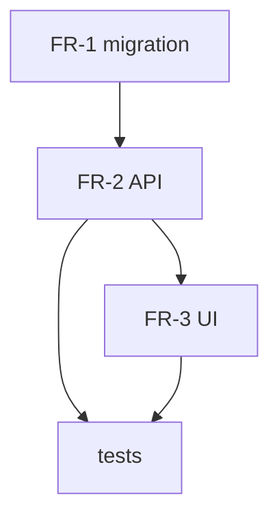

# ship-better-plans — Reference

Full procedure, persona prompts, and output schemas. `SKILL.md` is the lean dispatcher; this file is the detail. Read it before the first run.

---

## Phase 1 — Intake (detail)

Ask one question at a time (multiple-choice where possible). Capture into a working draft:

| Field | Prompt intent |
|-------|---------------|
| Problem (what) | The observable gap, stated without solution language. |
| Why | The motivation / cost of not doing it. Separate from "what". |
| Success criteria | Measurable, verifiable, agreed *before* design. "Done = …". |
| Non-goals | Explicitly out of scope, so the audit doesn't flag their absence. |
| Hard constraints | Time, tech stack, compliance, blocked-on-others. |
| Assumptions | Anything not verified. Flagged AS assumptions; high-risk ones become open questions. |
| Stakeholders / approvers | Who must agree. |
| Effort budget | Token / wall-clock / parallel-agent ceiling. Drives mode + DAG depth. |

**Scope-decomposition check.** If the ask spans multiple independent subsystems (e.g. "build auth AND a billing system AND a dashboard"), STOP. Present the decomposition and plan ONE coherent unit. Note the others as follow-on plans.

Skip a question only when the user already answered it; never invent an answer to keep moving.

---

## Phase 2 — Context discovery (detail)

Dispatch Explore subagents **in parallel** (one `Task` call per focus area, in a single message):
- existing implementations / utilities / patterns to reuse (return file paths)
- adjacent code that constrains the design (interfaces, types, call sites)
- test patterns and fixtures already in the repo

Always also run, directly:
- `docs/agent/MANIFEST.md` → relevant decisions, scars, open questions, patterns.
- `docs/agent/instructions/` → every active standing instruction (apply them).
- `docs/agent/status/` → sibling agents working in the same area (coordinate, don't collide).
- `AGENTS.md` / `CLAUDE.md` → static rules the plan must comply with.

Feed the reuse audit into Phase 3 so options prefer existing code over net-new.

---

## Phase 3 — Design with forced tradeoffs (detail)

Produce a scored table. Lower is better for effort/risk/blast-radius; reversibility is qualitative:

| Approach | Effort (1-5) | Risk (1-5) | Reversibility | Blast radius | Notes |
|----------|-------------|-----------|---------------|--------------|-------|
| A …      | 2 | 3 | reversible | one module | … |
| B …      | 4 | 2 | hard-to-reverse | service-wide | … |

Then: **recommended approach + why this, why not the others**; a risk register (probability × impact, each with a mitigation); per-step reversibility classification (safe / hard-to-reverse / destructive); a rollback plan; and — only if the work touches live state/data/schema — a migration plan with a back-out path.

---

## Phase 4 — Specification clarity gates (detail)

- **Functional requirements** — numbered, atomic, individually verifiable (FR-1, FR-2, …).
- **Non-functional** — perf, security, a11y, observability budgets, each as a concrete target.
- **Acceptance criteria** — testable conditions, each mapped to the FR it satisfies.
- **Interface contracts** — for every boundary: inputs, outputs, error cases.
- **Data shapes** — schemas / types for anything persisted or crossing a boundary.
- **Edge cases** — enumerate empty, max, malformed, concurrent, partial-failure, and permission-denied.
- **Open questions** — anything unresolved is flagged, never silently assumed.

---

## Phase 5 — Execution plan (detail)

Emit a **task DAG**, not a flat list. Each task: id, one-line description, dependencies, the subagent type that should own it, and a verification step.

Render as Mermaid (fallback: the markdown list is authoritative if Mermaid can't render):

````

````

- **Parallelization plan** — the concurrent-safe set (`{T?, T?}`) vs. the critical path.
- **Subagent-delegation map** — task → `Explore` / `feature-dev` / `code-reviewer` / Workflow fan-out.
- **Checkpoints** — gates between phases where the executor pauses for review.
- **Per-phase verification** — how each phase proves itself, not just an end-to-end check.
- **Per-phase effort budget** — token/wall-clock estimate so the executor scales depth. (This is the executor's budget — distinct from the D6 audit-cost gate, which is about running *this* skill.)

---

## Phase 6 — Audit personas (prompts)

Each persona receives the full plan text and returns findings under `FINDINGS_SCHEMA`. Prompts (paraphrase as needed):

- **Adversarial skeptic** — "Try to break this plan. Find false assumptions, missing edge cases, unstated dependencies, and steps that will fail in practice. Be specific about the failure."
- **Pragmatist** — "Find over-engineering, YAGNI violations, premature abstraction, and scope creep. What can be cut or simplified without losing a success criterion?"
- **Production reviewer** — "Review for security, infra, observability, rollback, and compliance gaps. What breaks in production that looks fine on paper?"
- **Test-strategist** *(if plan touches tests)* — "Is the test strategy adequate? Untested paths, missing edge-case coverage, flaky-prone designs?" May delegate to `ship-tested-code`.
- **Data-migrations** *(if plan touches schema/live data)* — "Is the migration safe, ordered, reversible? Data-loss or downtime risks?"
- **DevOps/SRE** *(if plan touches CI/IaC/deploy)* — "Pipeline, secrets, rollout, health checks, SLOs?" May delegate to `ship-devops`.

### Schemas

```javascript
// FINDINGS_SCHEMA — what each persona returns
{
  type: 'object',
  properties: {
    findings: {
      type: 'array',
      items: {
        type: 'object',
        properties: {
          id:       { type: 'string' },          // stable, e.g. "adv-3"
          title:    { type: 'string' },
          severity: { type: 'string', enum: ['blocker', 'major', 'minor'] },
          detail:   { type: 'string' },
          section:  { type: 'string' }            // which plan section it hits
        },
        required: ['id', 'title', 'severity', 'detail']
      }
    }
  },
  required: ['findings']
}

// VERDICT_SCHEMA — the refute pass per finding
{
  type: 'object',
  properties: {
    refuted:    { type: 'boolean' },              // default true when uncertain
    confidence: { type: 'string', enum: ['low', 'medium', 'high'] },
    reasoning:  { type: 'string' }
  },
  required: ['refuted', 'confidence', 'reasoning']
}
```

Keep only `!refuted` findings. Drop or flag `low` confidence. Fold confirmed findings into the plan and re-state what changed before the exit gate.

---

## Mode mechanics

- **standard** — one `parallel()` persona pass → `pipeline()` refute → fold in confirmed. Single round.
- **ultra** — the loop-until-dry harness in `workflows/audit.workflow.js`: repeat the find→verify round until `DRY_ROUNDS` (default 2) consecutive rounds add no new confirmed findings, deduping against everything already seen. Dedup against *seen*, not *confirmed*, or rejected findings reappear and the loop never converges.

---

## Anti-patterns (do not do)

- Asking a dump of questions at once (breaks operating rule 1).
- Launching the Workflow audit without the D6 cost gate.
- Writing to `docs/agent/` while in plan mode (violates D5 — defer to post-approval).
- Copying the SKILL.md audit example verbatim — the real script is in `workflows/`.
- Planning multiple independent subsystems as one plan (breaks rule 6).
- Exiting with a placeholder or empty required section (breaks rule 5).

---

## Related skills

- `ship-agent-context` — the `docs/agent/` substrate this writes into.
- `superpowers:executing-plans`, `superpowers:subagent-driven-development` — execution hand-off targets (Q1).
- `ship-secure-code` / `ship-tested-code` / `ship-devops` — audit-persona delegation targets.
