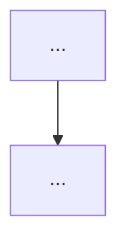

# Plan: {title}

## Context
Problem (what) and why — separated. What prompted this and the intended outcome.

## Success Criteria
Measurable, verifiable conditions agreed before design. Done = …

## Non-Goals
Explicitly out of scope.

## Constraints & Assumptions
- Constraint: …
- Assumption (flagged): …

## Approach (chosen)
The recommended approach + why this, why not the alternatives.

### Tradeoffs considered
| Approach | Effort | Risk | Reversibility | Blast radius | Notes |
|----------|--------|------|---------------|--------------|-------|

## Risks & Rollback
- Risk (prob × impact) → mitigation
- Rollback plan:
- Migration plan: (only if touching live state/data/schema)

## Specification
- Functional requirements (FR-1, FR-2, … — atomic, verifiable)
- Non-functional targets (perf/security/a11y/observability)
- Acceptance criteria (mapped to FRs)
- Interface contracts / data shapes
- Edge cases (empty/max/malformed/concurrent/partial-failure)

## Execution DAG

- Parallelizable set: { … }   ·   Critical path: …
- Subagent-delegation map: task → agent type
- Checkpoints / per-phase verification / per-phase budget

## Audit
Mode, personas run, confirmed findings folded in (or "skipped by user").

## Status
What's done, what's next, what's blocked.

## Related
- Link related notes, e.g. `[slug](../decisions/<slug>.md)` — why related
