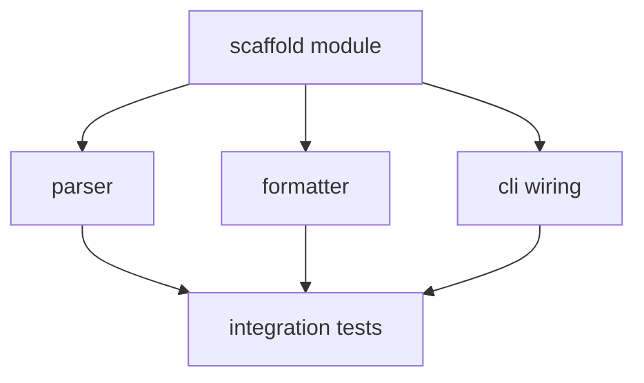

# Example — parallel DAG execution + integration-merge gate

Focuses on the hardest part: running an independent ready-set in parallel worktrees and merging the branches back safely. Also shows a BLOCKED escalation and the `solo` fallback.

---

## Parallel ready-set

Plan DAG:



After `T1` merges, `{T2, T3, T4}` are a mutually-independent ready-set → fan out via `workflows/execute.workflow.js` (3 worktrees):

```
Workflow ship-execute-fanout: 3 tasks
  task:T2 (worktree wt-T2) → DONE  (evidence: `pytest tests/parser` 18✓)
  task:T3 (worktree wt-T3) → DONE  (evidence: `pytest tests/formatter` 9✓)
  task:T4 (worktree wt-T4) → BLOCKED (CLI lib API changed; needs a decision)
```

## Integration-merge gate (main loop, with git)

```
merge wt-T2 → integration: clean; re-run `pytest tests/parser` → green ✓
merge wt-T3 → integration: CONFLICT in module/__init__.py exports
  → resolver subagent given both sides + FR-3 → resolved (kept both exports)
  → re-run affected tests → green ✓
T4 BLOCKED → STOP that branch. Escalate:

  "T4 (cli wiring) is blocked: the `click` API you planned around changed in v8.
   T2 and T3 are merged and green. Options:
     - decide the new CLI approach and I'll re-dispatch T4
     - skip T4 for this run (T5 integration tests depend on it, so they'd be deferred)
   How do you want to proceed?"
```

T4 is **not** silently skipped — T5 depends on it, so the run pauses for a real decision (hard rule 5).

## Sequential fallback (`/ship-execute solo`)

For a linear plan (every ready-set has one task) or when the user passes `solo`, the engine skips worktrees entirely and runs each task in order on the integration branch — same per-step evidence gate, no merge complexity. Use it when the plan has no real parallelism or you want fully deterministic ordering.
